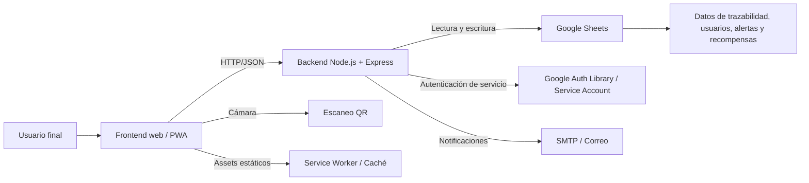
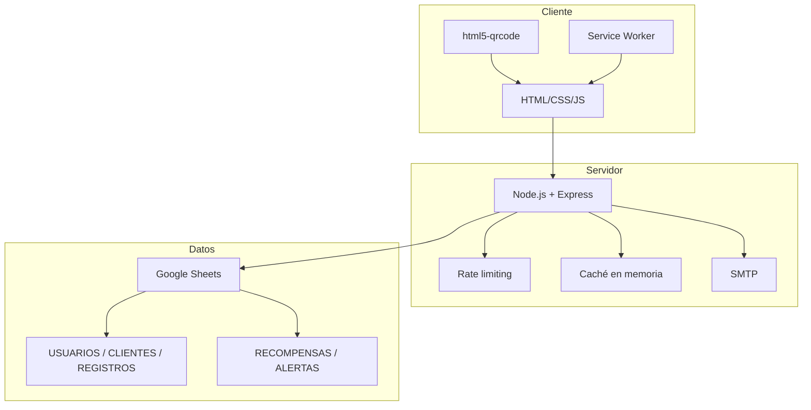
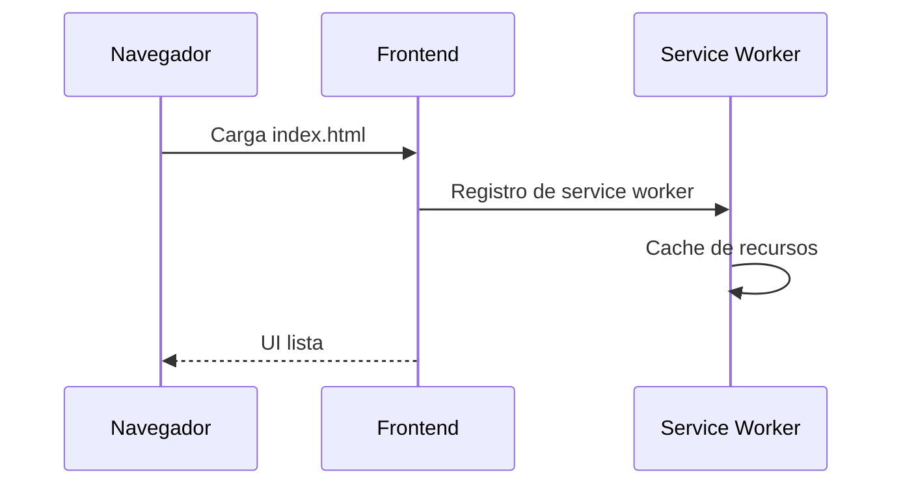
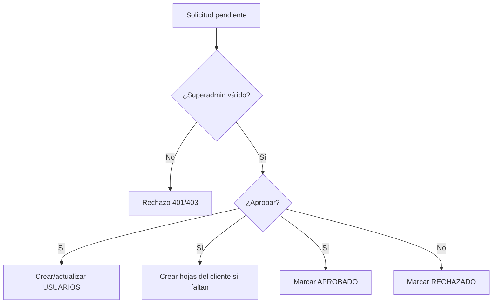
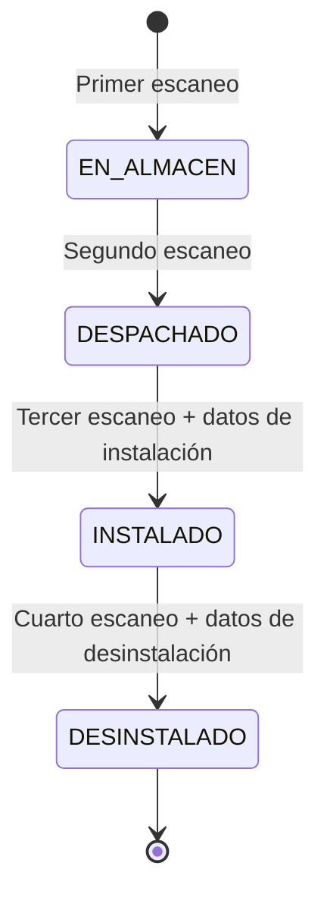

# 1. Portada

- Nombre del proyecto: Sistema de Trazabilidad con QR para Filtros Goby
- Cliente: INDUSTRIAS GOBY
- Versión: 1.0.0
- Fecha: 2026-07-01
- Autor: GitHub Copilot
- Estado del documento: Borrador técnico listo para entrega, sujeto a validación de datos operativos faltantes

# 2. Control de versiones

| Versión | Fecha | Autor | Descripción del cambio |
|---|---|---|---|
| 1.0.0 | 2026-07-01 | GitHub Copilot | Creación del documento técnico integral basado en el estado actual del repositorio. |

# 3. Objetivo del documento

Este documento tiene como propósito describir, de forma técnica, completa y verificable, la arquitectura, funcionamiento, componentes, integraciones, seguridad, instalación, configuración y operación del Sistema de Trazabilidad con QR para Filtros Goby. El objetivo es que cualquier desarrollador, administrador técnico o responsable de soporte pueda comprender el sistema, mantenerlo, modificarlo, desplegarlo y recuperarlo ante fallos sin depender del desarrollador original.

La documentación se basa en el código disponible en el repositorio, en la especificación IEEE 830 incluida en el proyecto y en los archivos de despliegue y frontend actualmente presentes. Cuando una capacidad no se puede confirmar por evidencia directa del código, se indica explícitamente en la sección de información pendiente.

# 4. Alcance

Este documento cubre el sistema web de trazabilidad QR, su backend Node.js, su frontend web/PWA, la persistencia basada en Google Sheets, el manejo de correos SMTP, las rutas API expuestas, el esquema de hojas, la estrategia de caché, los mecanismos de seguridad implementados y el procedimiento de despliegue definido en el repositorio.

No cubre funcionalidades no evidenciadas en el código, ni procesos externos no documentados en el repositorio, ni integraciones de terceros que no se encuentren referenciadas en los archivos inspeccionados. En particular, no se documentan como existentes módulos de WordPress o Apps Script si no se observan en el código fuente revisado.

# 5. Descripción general del sistema

## Problema que resuelve

El sistema resuelve la necesidad de registrar, rastrear y consultar el ciclo de vida de filtros y productos Goby mediante códigos QR, reduciendo el registro manual y centralizando la trazabilidad en una fuente de datos accesible desde la web. El sistema permite que distintos perfiles operativos registren eventos sobre un mismo producto a lo largo de su vida útil: ingreso a almacén, despacho, instalación y desinstalación.

## Objetivo del sistema

El objetivo funcional es capturar escaneos QR desde cámara, interpretar el contenido del código, validar el estado del producto y persistir cada transición en Google Sheets como fuente principal de verdad. Además, el sistema gestiona usuarios por rol, solicitudes de registro, estadísticas, proyecciones de duración de filtros, recompensas por actividad y notificaciones internas por alertas.

## Usuarios

El sistema contempla los siguientes perfiles lógicos:

- Superadmin: acceso total, gestión global de usuarios, aprobación/rechazo de solicitudes, consulta global de métricas y recompensas.
- Administrador: acceso restringido a su cliente, con permisos administrativos sobre usuarios y métricas del alcance asignado.
- Mecánico: usuario operativo que puede escanear, consultar sus registros y ver recompensas asociadas.
- Despacho: usuario operativo orientado a despacho y entrada/salida de inventario.

## Flujo general

1. El usuario abre la aplicación web.
2. El frontend registra el service worker y habilita la experiencia PWA.
3. El usuario inicia sesión según su tipo de acceso.
4. El frontend obtiene credenciales y, cuando aplica, selecciona cliente.
5. El usuario escanea un QR desde la cámara.
6. El frontend envía el contenido al backend.
7. El backend valida formato, estado, permisos y existencia del registro.
8. El backend actualiza la hoja global REGISTROS y, cuando corresponde, la hoja específica del cliente.
9. El backend registra estadísticas, recompensas, alertas o solicitudes asociadas.
10. El frontend muestra el resultado y actualiza tablas y métricas.

## Beneficios

- Trazabilidad completa por referencia y serial.
- Reducción de errores de digitación y registro manual.
- Centralización de datos en Google Sheets con control por hoja.
- Segmentación por cliente y por rol.
- Consulta histórica de registros, estadísticas, proyecciones y recompensas.
- Posibilidad de operar como PWA en navegadores compatibles.

## Arquitectura general



# 6. Arquitectura del sistema

## Frontend

El frontend está construido con HTML, CSS y JavaScript nativo. Se sirve desde la carpeta public y se comporta como una aplicación web de una sola página con múltiples vistas internas. El archivo principal de interfaz es public/index.html, complementado por public/assets/js/app.js, public/assets/js/contact-module.js y public/assets/js/rewards-catalog.js.

Responsabilidades del frontend:

- Renderizar la interfaz de usuario.
- Administrar el escáner QR mediante html5-qrcode.
- Gestionar la navegación por vistas: escaneo, registros, usuarios, clientes, proyecciones, recompensas, contacto y perfil.
- Consumir la API del backend.
- Mostrar estados, métricas, tablas, alertas y modales.
- Registrar y manejar la instalación PWA.
- Cachear activos mediante service worker.

## Backend

El backend está implementado en Node.js con Express. Expone rutas API para autenticación, gestión de usuarios, solicitudes de contacto, guardado de QR, estadísticas, proyecciones, recompensas, alertas y carga masiva.

Características técnicas del backend:

- Carga variables de entorno con dotenv.
- Comprime respuestas con compression.
- Habilita CORS.
- Usa body-parser para JSON.
- Implementa control de tasa en memoria para proteger rutas críticas.
- Usa google-spreadsheet y google-auth-library para operar con Google Sheets.
- Usa nodemailer para envío de correos.
- Incluye reintentos ante fallos transitorios de Google Sheets.
- Aplica caching en memoria para reducir consumo de cuota.

## Servicios

Servicios internos implementados en el backend:

- Persistencia en Google Sheets como base de datos principal.
- Caché en memoria para objetos de Google Sheets y resultados API.
- Validación de usuarios, contraseñas y tipo de acceso.
- Registro de alertas y recompensas.
- Fallback local para solicitudes de contacto si falla Google Sheets.

## Apps Script

No se encontraron archivos de Apps Script dentro del repositorio analizado. Por lo tanto, no puede documentarse como componente existente del sistema a partir de esta evidencia.

## WordPress

No se encontraron referencias a WordPress, plugins, temas, shortcodes, endpoints o integraciones WordPress dentro del código revisado. No se documenta como parte activa del sistema con la información disponible.

## Google Sheets

Google Sheets actúa como repositorio central de datos. El backend crea y mantiene hojas principales y hojas por cliente. La estructura se autoevalúa y agrega encabezados faltantes cuando corresponde.

Hojas principales detectadas:

- REGISTROS
- USUARIOS
- USUARIOS_PENDIENTES
- CLIENTES
- RECOMPENSAS
- RECOMPENSAS_HISTORIAL
- ALERTAS
- SOLICITUDES

Hojas por cliente:

- <CLIENTE>_USUARIOS
- <CLIENTE>_REGISTROS

## Google Drive

El backend solicita el scope de Drive.file junto con el scope de Sheets. No se observan operaciones explícitas sobre archivos de Google Drive en el código revisado, pero sí dependencia de acceso asociado al proyecto de servicio de Google para operar con la hoja de cálculo.

## Servicios externos

Servicios externos evidenciados:

- Google Sheets API.
- SMTP para envío de correos.
- HTML5 QR Code desde CDN.
- Chart.js desde CDN.
- SheetJS XLSX desde CDN.

## QR

El QR se interpreta desde el frontend como texto estructurado. El backend espera el formato REFERENCIA|SERIAL para los productos trazables. Si el contenido no sigue el formato esperado, la operación se rechaza.

## Integraciones

Integraciones reales observadas en el repositorio:

- Frontend -> Backend por HTTP/JSON.
- Backend -> Google Sheets por service account.
- Backend -> SMTP para correos.
- Frontend -> CDN para librerías de escaneo, gráficas y exportación.
- Frontend -> Service Worker para caché y modo offline parcial.

### Diagrama de arquitectura



# 7. Tecnologías utilizadas

| Tecnología | Versión | Propósito | Dependencias | Ventajas |
|---|---:|---|---|---|
| Node.js | >= 16.0.0 | Ejecución del backend | Sistema operativo, runtime | Estable, ampliamente soportado |
| npm | >= 8.0.0 | Gestión de paquetes | Node.js | Instalación y scripts estándar |
| Express | 4.18.2 | Framework HTTP | Node.js | Rutas, middlewares y serving estático |
| dotenv | 16.3.1 | Carga de variables de entorno | Archivo .env o entorno del host | Separación de configuración y código |
| cors | 2.8.5 | Control de acceso cross-origin | Express | Simplifica consumo desde frontend |
| body-parser | 1.20.2 | Parseo de JSON | Express | Manejo consistente de request bodies |
| compression | 1.8.1 | Compresión HTTP | Express | Reduce ancho de banda |
| google-spreadsheet | 4.1.0 | Acceso a Google Sheets | Credenciales Google | API de alto nivel para hojas |
| google-auth-library | 9.6.3 | Autenticación con service account | Credenciales JSON | Autenticación segura |
| googleapis | 128.0.0 | SDK oficial Google | Credenciales Google | Soporte para APIs Google |
| nodemailer | 6.9.13 | Envío de correos SMTP | Servidor de correo | Compatible con múltiples proveedores |
| nodemon | 3.0.1 | Desarrollo local | Node.js | Reinicio automático en cambios |
| html5-qrcode | 2.3.8 | Lectura de QR en navegador | Cámara y permisos del navegador | Escaneo QR robusto |
| Chart.js | 4.4.0 | Gráficas en frontend | Navegador | Visualización clara de estadísticas |
| SheetJS XLSX | 0.18.5 | Exportación de datos | Navegador | Exportación Excel/CSV |

# 8. Infraestructura

## Hosting

El archivo render.yaml indica despliegue en Render como servicio web Node. La configuración actual usa:

- Runtime: node
- Región: oregon
- Plan: free
- buildCommand: npm install
- startCommand: node server.js
- healthCheckPath: /api/health
- autoDeploy: true

## Dominio

No se encontró configuración de dominio personalizada en el repositorio. El dominio público real debe documentarse por separado en la información pendiente.

## DNS

No existe evidencia de registros DNS dentro del repositorio. La administración DNS depende del proveedor del dominio y del hosting final.

## SSL

No se observan certificados instalados ni archivos de configuración SSL local. En Render, el SSL suele ser administrado por la plataforma, pero el detalle exacto del dominio y del certificado no está en el repositorio.

## Apps Script

No documentado en el código analizado. Si existe fuera del repositorio, debe añadirse como activo operativo y detallarse su proyecto, URL de despliegue, scripts, gatillos y permisos.

## Google Workspace

El sistema depende de credenciales de Google de tipo service account y de una hoja compartida. Deben existir permisos concedidos sobre el spreadsheet objetivo para la cuenta de servicio configurada.

## Google Drive

Se requiere acceso indirecto vía scopes de Google para la operación con Sheets. No se observan automatizaciones de archivos Drive, carpetas o permisos compartidos sobre documentos de Drive.

## Google Sheets

Google Sheets es el repositorio principal. El sistema crea hojas nuevas cuando no existen y extiende encabezados automáticamente si faltan campos obligatorios.

## WordPress

No hay evidencia de WordPress ni de plugins instalados en este repositorio.

## Plugins utilizados

No se evidencian plugins WordPress. En el ecosistema técnico real del proyecto sí se observan librerías frontend externas y dependencias Node, pero no plugins de CMS.

## Configuraciones importantes

- El servidor fuerza resolución DNS IPv4 primero para evitar problemas de conexión con googleapis en entornos con IPv6 inestable.
- El agente HTTPS global desactiva keep-alive para reducir errores de sockets obsoletos en Render.
- El service worker cachea activos estáticos y excluye requests API del modo de caché.
- Las respuestas estáticas usan cache-control diferenciado para HTML, JS y assets de imagen.

# 9. Componentes del sistema

## Frontend principal

Objetivo: administrar la interfaz de usuario, el escaneo QR y la navegación entre vistas.

Entradas: eventos del usuario, cámara, respuestas API, datos de configuración y permisos.

Salidas: requests HTTP al backend, render de tablas, modales, métricas, notificaciones y estados visuales.

Dependencias: app.js, CSS, librerías CDN, backend API, service worker.

Responsabilidades: orquestación de vistas, validación básica, escaneo, consumo de API, presentación de resultados.

Errores posibles: permisos de cámara denegados, respuesta 429 por cuota, sesión inválida, formato QR incorrecto, fallo de red.

## Módulo de contacto

Objetivo: renderizar un bloque de canales oficiales de contacto.

Entradas: contenedor DOM y overrides opcionales.

Salidas: tarjetas de contacto con correo, teléfono y WhatsApp.

Dependencias: DOM, estilos de UI.

Responsabilidades: mostrar datos corporativos de contacto de forma reutilizable.

Errores posibles: contenedor inexistente, datos incompletos o href inválido.

## Catálogo de recompensas

Objetivo: definir los premios disponibles y su costo en puntos.

Entradas: carga estática de un arreglo global.

Salidas: catálogo consumible por la vista de recompensas.

Dependencias: frontend app.js y recursos de imágenes.

Responsabilidades: centralizar nombres, costos, IDs e imágenes de premios.

Errores posibles: asset faltante, ID duplicado, inconsistencia entre catálogo y hojas de recompensas.

## Backend HTTP

Objetivo: exponer y proteger la API del sistema.

Entradas: requests HTTP con JSON, headers de autenticación, parámetros query.

Salidas: respuestas JSON, estados HTTP, headers de rate limit y cache.

Dependencias: Google Sheets, nodemailer, variables de entorno, cachés de proceso.

Responsabilidades: validación, persistencia, cálculo de métricas, aplicación de reglas de negocio.

Errores posibles: credenciales ausentes, cuota Google excedida, error SMTP, hoja faltante, permisos insuficientes.

## Persistencia Google Sheets

Objetivo: almacenar y consultar datos operativos.

Entradas: filas nuevas, actualizaciones de celdas, lectura de hojas.

Salidas: registros persistidos y estructuras actualizadas.

Dependencias: service account, ID de spreadsheet, API Sheets.

Responsabilidades: actúa como base de datos lógica del sistema.

Errores posibles: quota exceeded, permisos denegados, cabeceras faltantes, fallos de red, conflictos de concurrencia.

## Recompensas

Objetivo: acumular puntos por instalación y desinstalación y permitir redención de premios.

Entradas: eventos de instalación/desinstalación, solicitudes de canje.

Salidas: saldo de puntos, historial de movimientos, alertas de canje.

Dependencias: hojas RECOMPENSAS, RECOMPENSAS_HISTORIAL y ALERTAS.

Responsabilidades: mantener acumulado por identificador y registrar movimientos.

Errores posibles: saldo insuficiente, identificador inexistente, validación de entrega incompleta.

## Notificaciones y alertas

Objetivo: notificar solicitudes de registro y canjes relevantes.

Entradas: eventos de registro pendiente, aprobación, rechazo y redención.

Salidas: filas en ALERTAS y correos SMTP.

Dependencias: Google Sheets, SMTP, cuentas de superadmin.

Responsabilidades: visibilizar eventos críticos a administradores.

Errores posibles: correo no configurado, destinatarios ausentes, error de escritura en hojas.

# 10. Procesos del sistema

## Proceso 1: Inicio y carga de la aplicación

Objetivo: preparar la interfaz, registrar el service worker y dejar el sistema listo para autenticación y escaneo.

Flujo:

1. El navegador descarga index.html.
2. Se cargan CSS, app.js, contact-module.js, rewards-catalog.js y librerías CDN.
3. El frontend registra el service worker.
4. El service worker instala y cachea los recursos estáticos.
5. El usuario visualiza el menú principal y las vistas disponibles según su sesión.

Entradas: HTML, CSS, JS, manifiesto PWA y assets.

Validaciones: disponibilidad de scripts, soporte del navegador, permisos PWA.

Resultados: interfaz operativa, caché inicial y capacidad de navegación offline parcial.

Errores: fallo de carga de CDN, service worker no soportado, assets ausentes.



## Proceso 2: Validación de usuario

Objetivo: autenticar al usuario y determinar su rol efectivo.

Flujo:

1. El usuario envía usuario, tipo y contraseña.
2. El backend consulta Google Sheets.
3. Se localiza el usuario por credencial o identificador.
4. Se valida la contraseña y el tipo permitido.
5. Se devuelve el rol operativo y el cliente asociado.

Entradas: usuario, tipo y contraseña.

Validaciones: campos obligatorios, coincidencia de credenciales, compatibilidad de tipo.

Resultados: sesión lógica autorizada o rechazo.

Errores: usuario no autorizado, tipo no permitido, credenciales inválidas.

## Proceso 3: Registro de una solicitud de usuario

Objetivo: capturar una nueva solicitud de alta para posterior aprobación por superadmin.

Flujo:

1. El usuario completa nombre, correo, teléfono, cliente y contraseña.
2. El backend valida correo, teléfono y fortaleza de contraseña.
3. Se verifica que no exista el usuario en la hoja global, pendientes o por cliente.
4. Se genera un ID de solicitud.
5. La solicitud se almacena en USUARIOS_PENDIENTES.
6. Se crean alertas y correos para superadmins.
7. Se notifica al solicitante.

Entradas: datos del formulario de registro.

Validaciones: formato email, mínimo de dígitos en teléfono, contraseña fuerte, ausencia de duplicados.

Resultados: solicitud en estado PENDIENTE.

Errores: duplicado, cliente no válido, error de Google Sheets, error SMTP.

## Proceso 4: Aprobación o rechazo de solicitudes

Objetivo: resolver solicitudes de usuario pendientes.

Flujo:

1. El superadmin consulta pendientes con credenciales válidas.
2. Selecciona aprobar o rechazar una solicitud.
3. Si aprueba, el usuario se copia a USUARIOS y a la hoja del cliente cuando aplique.
4. Si el cliente no existe, se crea automáticamente.
5. La solicitud cambia de estado a APROBADO o RECHAZADO.

Entradas: requestId y credenciales de superadmin.

Validaciones: autenticación, existencia de solicitud, estado PENDIENTE.

Resultados: usuario creado o solicitud descartada.

Errores: solicitud no encontrada, no autorizado, usuario duplicado.



## Proceso 5: Escaneo y registro de QR

Objetivo: registrar la transición de un producto según el estado actual de trazabilidad.

Flujo:

1. El usuario escanea un QR con formato REFERENCIA|SERIAL.
2. El frontend envía el contenido al endpoint /api/save-qr.
3. El backend valida el formato.
4. Si el producto no existe, crea el estado EN ALMACEN.
5. Si existe en EN ALMACEN, cambia a DESPACHADO.
6. Si existe en DESPACHADO, solicita o aplica datos de instalación y cambia a INSTALADO.
7. Si existe en INSTALADO, solicita o aplica datos de desinstalación y cambia a DESINSTALADO.
8. El backend actualiza también la hoja del cliente cuando corresponde.
9. En instalación y desinstalación se acreditan puntos.

Entradas: qrContent, userEmail, userClient, userTipo y datos complementarios de instalación/desinstalación.

Validaciones: formato QR, cliente requerido para despacho, campos auxiliares requeridos por etapa, existencia del registro, permisos.

Resultados: filas sincronizadas entre REGISTROS y hojas por cliente.

Errores: QR inválido, cliente faltante, cuotas de Google, falla de escritura, datos auxiliares incompletos.



## Proceso 6: Consulta de registros y estadísticas

Objetivo: obtener el histórico reciente y los indicadores operativos.

Flujo:

1. El frontend solicita registros recientes o estadísticas.
2. El backend valida credenciales por headers.
3. El backend lee la hoja global REGISTROS.
4. Aplica filtros por cliente, usuario o rol.
5. Calcula métricas de estados y eventos.
6. Devuelve datos para tablas y tarjetas.

Entradas: credenciales, filtros por cliente y límite de filas.

Validaciones: autenticación, restricciones por rol, límite de consulta.

Resultados: dataset filtrado y estadísticas agregadas.

Errores: no autorizado, cuota excedida, problema de lectura.

## Proceso 7: Recompensas

Objetivo: acumular y redimir puntos por eventos operativos.

Flujo:

1. Una instalación o desinstalación acredita un punto.
2. El backend actualiza RECOMPENSAS y registra el movimiento en RECOMPENSAS_HISTORIAL.
3. Un usuario o administrador consulta el saldo mediante /api/rewards.
4. Un usuario redime puntos mediante /api/rewards/redeem.
5. El sistema valida saldo y datos de entrega.
6. Si el canje es válido, descuenta puntos y crea alertas.

Entradas: identificador, puntos, referencia, serial, datos de entrega.

Validaciones: saldo suficiente, datos de entrega obligatorios, permisos de consulta.

Resultados: saldo actualizado e historial trazable.

Errores: puntos insuficientes, identificador inexistente, entrega incompleta.

# 11. Base de datos

El sistema no utiliza una base de datos relacional tradicional. Google Sheets cumple el papel de persistencia principal. Por tanto, cada hoja debe documentarse como si fuera una tabla lógica.

## Hoja: REGISTROS

Propósito: almacenar la trazabilidad principal de productos.

| Campo | Tipo de dato | Descripción |
|---|---|---|
| ID | Numérico / texto | Identificador correlativo del registro. |
| REFERENCIA | Texto | Referencia del producto o filtro. |
| SERIAL | Texto | Serial único del producto. |
| ESTADO | Texto | Estado actual: EN ALMACEN, DESPACHADO, INSTALADO, DESINSTALADO. |
| CLIENTE | Texto | Cliente asociado. |
| USUARIO_DESPACHO | Texto | Usuario que marcó despacho. |
| USUARIO_PLANTA | Texto | Usuario que registró ingreso a almacén. |
| USUARIO_INSTALACION | Texto | Usuario que registró instalación. |
| USUARIO_DESINSTALACION | Texto | Usuario que registró desinstalación. |
| PLACA | Texto | Placa del vehículo asociada a instalación. |
| KILOMETRAJE_INSTALACION | Texto / numérico | Kilometraje al instalar. |
| KILOMETRAJE_DESINSTALACION | Texto / numérico | Kilometraje al desinstalar. |
| FECHA_ALMACEN | Texto | Fecha de registro inicial. |
| FECHA_DESPACHO | Texto | Fecha de despacho. |
| FECHA_INSTALACION | Texto | Fecha de instalación. |
| FECHA_DESINSTALACION | Texto | Fecha de desinstalación. |
| HORA_ALMACEN | Texto | Hora de ingreso. |
| HORA_DESPACHO | Texto | Hora de despacho. |
| HORA_INSTALACION | Texto | Hora de instalación. |
| HORA_DESINSTALACION | Texto | Hora de desinstalación. |
| NOMBRE_INSTALADOR | Texto | Nombre libre del instalador. |

Relaciones:

- Se relaciona con USUARIOS por usuario responsable.
- Se relaciona con CLIENTES por cliente.
- Se refleja en hojas por cliente con la misma estructura.

Llaves:

- Llave lógica sugerida: REFERENCIA + SERIAL.
- ID es correlativo, no necesariamente llave primaria robusta.

Validaciones:

- REFERENCIA y SERIAL deben existir al registrar QR.
- DESPACHO requiere cliente en usuarios de despacho.

## Hoja: USUARIOS

Propósito: almacenar usuarios globales.

| Campo | Tipo de dato | Descripción |
|---|---|---|
| NOMBRE | Texto | Nombre del usuario. |
| TELEFONO | Texto | Teléfono de contacto. |
| USUARIO | Texto | Identificador de ingreso, normalmente correo. |
| TIPO | Texto | Rol: super, administrador, mecanico, despacho. |
| CONTRASEÑA | Texto | Contraseña almacenada según lógica actual del sistema. |
| CLIENTE | Texto | Cliente asignado. |

Relaciones:

- Se relaciona con CLIENTES.
- Puede replicarse en hojas por cliente.

Llaves:

- Llave lógica: USUARIO.

Validaciones:

- USUARIO debe ser único dentro del sistema.
- CLIENTE puede ser opcional solo para superadmin.

## Hoja: USUARIOS_PENDIENTES

Propósito: almacenar solicitudes de registro en espera de aprobación.

| Campo | Tipo de dato | Descripción |
|---|---|---|
| ID | Texto | Identificador de solicitud. |
| NOMBRE | Texto | Nombre del solicitante. |
| TELEFONO | Texto | Teléfono del solicitante. |
| USUARIO | Texto | Correo o usuario propuesto. |
| CONTRASEÑA | Texto | Contraseña propuesta. |
| CLIENTE | Texto | Cliente asociado. |
| TIPO | Texto | Tipo solicitado o por defecto. |
| ESTADO | Texto | PENDIENTE, APROBADO, RECHAZADO. |
| CLIENTE_NUEVO | Texto | Marca de si el cliente ya existía. |
| CREADO_EN | Texto | Fecha y hora de creación. |
| APROBADO_EN | Texto | Fecha y hora de aprobación. |
| APROBADO_POR | Texto | Usuario superadmin que aprobó. |
| RECHAZADO_EN | Texto | Fecha y hora de rechazo. |
| RECHAZADO_POR | Texto | Usuario que rechazó. |

## Hoja: CLIENTES

Propósito: catálogo de clientes operativos del sistema.

| Campo | Tipo de dato | Descripción |
|---|---|---|
| NOMBRE | Texto | Nombre del cliente. |
| FECHA_REGISTRO | Texto | Fecha de alta en el sistema. |

Llaves:

- Llave lógica: NOMBRE.

## Hoja: RECOMPENSAS

Propósito: saldo acumulado de puntos por usuario.

| Campo | Tipo de dato | Descripción |
|---|---|---|
| IDENTIFICADOR | Texto | Clave del usuario en minúsculas. |
| NOMBRE | Texto | Nombre visible del usuario. |
| PUNTOS | Numérico | Puntos acumulados. |
| INSTALACIONES | Numérico | Puntos por instalación. |
| DESINSTALACIONES | Numérico | Puntos por desinstalación. |
| REDENCIONES | Numérico | Puntos consumidos. |
| ACTUALIZADO_EN | Texto | Marca temporal de última actualización. |

## Hoja: RECOMPENSAS_HISTORIAL

Propósito: historial de movimientos de recompensas.

| Campo | Tipo de dato | Descripción |
|---|---|---|
| IDENTIFICADOR | Texto | Usuario afectado. |
| MOVIMIENTO | Texto | Tipo de movimiento, por ejemplo GANADO_INSTALACION o redención. |
| PUNTOS | Numérico | Cantidad de puntos del movimiento. |
| REFERENCIA | Texto | Referencia del producto. |
| SERIAL | Texto | Serial del producto. |
| DESCRIPCION | Texto | Descripción del evento. |
| FECHA | Texto | Fecha y hora del movimiento. |
| ENTREGA_NOMBRE | Texto | Datos de entrega para canje. |
| ENTREGA_TELEFONO | Texto | Datos de entrega para canje. |
| ENTREGA_DIRECCION | Texto | Datos de entrega para canje. |
| ENTREGA_CIUDAD | Texto | Datos de entrega para canje. |
| ENTREGA_NOTAS | Texto | Observaciones del canje. |

## Hoja: ALERTAS

Propósito: alertas operativas para superadmin y administrador.

| Campo | Tipo de dato | Descripción |
|---|---|---|
| ID | Texto | Identificador de alerta. |
| DESTINATARIO | Texto | Usuario que debe recibirla. |
| DESTINATARIO_TIPO | Texto | Tipo de destinatario. |
| CLIENTE | Texto | Cliente relacionado. |
| EVENTO | Texto | Tipo de evento. |
| MENSAJE | Texto | Mensaje visible. |
| DETALLE | Texto | Datos adicionales serializados. |
| FECHA | Texto | Fecha de creación. |
| LEIDO | Texto | SI o NO. |
| LEIDO_EN | Texto | Fecha de lectura. |

## Hoja: SOLICITUDES

Propósito: registrar solicitudes recibidas desde el formulario de contacto.

| Campo | Tipo de dato | Descripción |
|---|---|---|
| FECHA | Texto | Fecha de solicitud. |
| HORA | Texto | Hora de solicitud. |
| SOLICITUD | Texto | Texto libre de la solicitud. |
| NOMBRE | Texto | Nombre de quien contacta. |
| EMAIL | Texto | Correo de contacto. |
| TELEFONO | Texto | Teléfono de contacto. |
| USUARIO_APP | Texto | Usuario del sistema, si existe. |
| CLIENTE_APP | Texto | Cliente asociado desde la aplicación. |
| ROL_APP | Texto | Rol del solicitante. |
| IP | Texto | Dirección IP origen. |
| USER_AGENT | Texto | Agente de navegador. |
| TIMESTAMP_ISO | Texto | Fecha ISO de auditoría. |

## Hojas por cliente: <CLIENTE>_USUARIOS

Propósito: réplica de usuarios del cliente.

Campos: NOMBRE, USUARIO, TIPO, CONTRASEÑA, CLIENTE.

Relaciones: con USUARIOS global y con la entidad CLIENTE.

## Hojas por cliente: <CLIENTE>_REGISTROS

Propósito: réplica de trazabilidad específica del cliente.

Campos: misma estructura que REGISTROS, con NOMBRE_INSTALADOR incluido.

Llaves y validaciones: iguales a REGISTROS.

# 12. Variables de entorno

| Nombre | Propósito | Valor esperado | Dónde se configura | Impacto |
|---|---|---|---|---|
| PORT | Puerto del servidor | Número de puerto | Hosting o entorno local | Define el puerto HTTP |
| NODE_ENV | Modo de ejecución | production o development | Hosting o .env | Activa comportamientos de producción |
| GOOGLE_CLIENT_EMAIL | Service account email | Correo técnico de Google | Render o .env | Acceso a Google Sheets |
| GOOGLE_PRIVATE_KEY | Clave privada de service account | Clave PEM con saltos de línea escapados | Render o .env | Autenticación Google |
| GOOGLE_SPREADSHEET_ID | Identificador del spreadsheet | ID válido de Google Sheets | Render o .env | Selección de la hoja base |
| SMTP_HOST | Servidor SMTP | Host válido | Render o .env | Envío de correos |
| SMTP_PORT | Puerto SMTP | 587, 465 u otro válido | Render o .env | Conexión al SMTP |
| SMTP_SECURE | TLS/SSL SMTP | true o false | Render o .env | Seguridad del canal SMTP |
| SMTP_USER | Usuario SMTP | Correo o login válido | Render o .env | Autenticación de correo |
| SMTP_PASS | Contraseña SMTP | Secreto válido | Render o .env | Autenticación de correo |
| SMTP_FROM | Remitente visible | Correo remitente | Render o .env | Dirección de envío |
| SMTP_SERVICE | Servicio preconfigurado | Opcional | Render o .env | Simplifica configuración |
| SUPERADMIN_1_EMAIL | Correo superadmin 1 | Correo válido | Render o .env | Destinatario de alertas |
| SUPERADMIN_2_EMAIL | Correo superadmin 2 | Correo válido | Render o .env | Destinatario de alertas |
| RATE_LIMIT_WINDOW_MS | Ventana rate limit | Milisegundos | Render o .env | Control de tráfico |
| RATE_LIMIT_AUTH_MAX | Máx. auth por ventana | Entero | Render o .env | Protege login |
| RATE_LIMIT_PUBLIC_MAX | Máx. públicas por ventana | Entero | Render o .env | Protege endpoints públicos |
| RATE_LIMIT_SCAN_MAX | Máx. escaneos por ventana | Entero | Render o .env | Protege endpoint de QR |
| SHEETS_RETRY_MAX_ATTEMPTS | Reintentos Sheets | Entero | Render o .env | Robustez ante fallos |
| SHEETS_RETRY_BASE_DELAY_MS | Retardo inicial reintentos | Milisegundos | Render o .env | Backoff exponencial |
| SHEETS_RETRY_MAX_DELAY_MS | Retardo máximo reintentos | Milisegundos | Render o .env | Evita espera excesiva |
| SHEETS_DOC_CACHE_TTL_MS | Caché doc Sheets | Milisegundos | Render o .env | Reduce cuota API |
| SHEETS_LOADINFO_TTL_MS | Caché loadInfo | Milisegundos | Render o .env | Reduce lecturas |
| SHEETS_HEADER_TTL_MS | Caché headers | Milisegundos | Render o .env | Optimiza headers |
| SUPERADMIN_RECORDS_CACHE_TTL_MS | Caché de registros superadmin | Milisegundos | Render o .env | Mejora rendimiento |
| SUPERADMIN_RECORDS_CACHE_MAX_KEYS | Máx. llaves caché registros | Entero | Render o .env | Control de memoria |
| API_RESPONSE_CACHE_TTL_MS | Caché de respuestas API | Milisegundos | Render o .env | Reduce lecturas repetidas |
| API_QUOTA_ERROR_CACHE_TTL_MS | Caché de errores cuota | Milisegundos | Render o .env | Evita golpear API en error |
| RECORDS_ROWS_CACHE_TTL_MS | Caché de filas REGISTROS | Milisegundos | Render o .env | Reduce lecturas duplicadas |
| BULK_WRITE_DELAY_MS | Pausa entre escrituras masivas | Milisegundos | Render o .env | Protege cuota Google |

# 13. APIs e integraciones

## API interna del sistema

### POST /api/contact-request

Objetivo: registrar una solicitud de contacto.

Métodos: POST.

Parámetros: solicitud, nombre, email, telefono, usuarioApp, clienteApp, rolApp.

Respuesta: success y savedTo indicando si quedó en Sheets o en fallback local.

Errores: validación de solicitud, correo inválido, teléfono insuficiente, error interno.

Ejemplo:

```json
{
  "solicitud": "Necesito soporte con el scanner",
  "nombre": "Juan Perez",
  "email": "juan@empresa.com",
  "telefono": "3000000000",
  "usuarioApp": "juan@empresa.com",
  "clienteApp": "ACME",
  "rolApp": "mecanico"
}
```

### POST /api/validate-user

Objetivo: validar credenciales y tipo de acceso.

Métodos: POST.

Parámetros: usuario, tipo, password.

Respuesta: success, tipo, usuario, nombre, role, cliente.

Errores: campos requeridos, usuario no autorizado, tipo no autorizado.

### POST /api/forgot-password

Objetivo: enviar correo de confirmación para recuperación de cuenta.

Métodos: POST.

Parámetros: usuario.

Respuesta: mensaje genérico de confirmación para evitar enumeración.

Errores: correo no configurado, usuario ambiguo, SMTP inválido.

### POST /api/register

Objetivo: crear solicitud de registro pendiente.

Métodos: POST.

Parámetros: nombre, correo, telefono, usuario, password, cliente.

Respuesta: requestId y mensaje de solicitud enviada.

Errores: validación de datos, duplicados, cliente inválido, cuota o escritura fallida.

### GET /api/register/pending

Objetivo: listar solicitudes pendientes.

Métodos: GET.

Headers: x-auth-user, x-auth-password.

Respuesta: lista de solicitudes PENDIENTES.

Errores: credenciales requeridas, no autorizado, cuota excedida.

### POST /api/register/approve

Objetivo: aprobar una solicitud pendiente.

Métodos: POST.

Headers: x-auth-user, x-auth-password.

Body: requestId.

Respuesta: solicitud aprobada y usuario creado.

Errores: solicitud no encontrada, estado incorrecto, no autorizado.

### POST /api/register/reject

Objetivo: rechazar una solicitud pendiente.

Métodos: POST.

Headers: x-auth-user, x-auth-password.

Body: requestId.

Respuesta: solicitud rechazada.

Errores: solicitud no encontrada, no autorizado.

### GET /api/profile

Objetivo: obtener perfil del usuario autenticado.

Métodos: GET.

Headers: credenciales de autenticación.

Respuesta: datos del perfil y entorno de usuario.

Errores: no autorizado, usuario no encontrado.

### GET /api/users

Objetivo: listar usuarios según rol.

Métodos: GET.

Headers: credenciales.

Respuesta: lista de usuarios del alcance permitido.

Errores: no autorizado, filtrado de cliente inválido.

### POST /api/users

Objetivo: crear o actualizar usuario.

Métodos: POST.

Body: usuario, tipo, password, cliente, authUser, authPassword.

Respuesta: usuario creado o actualizado.

Errores: tipo inválido, cliente requerido, no autorizado.

### DELETE /api/users/:usuario

Objetivo: eliminar usuario.

Métodos: DELETE.

Headers: x-auth-user, x-auth-password.

Respuesta: usuario eliminado.

Errores: no autorizado, usuario no encontrado.

### PUT /api/users/:usuario

Objetivo: actualizar usuario existente.

Métodos: PUT.

Body: tipo, password, cliente, authUser, authPassword.

Respuesta: usuario actualizado.

Errores: no autorizado, usuario no encontrado.

### GET /api/clients

Objetivo: listar clientes.

Métodos: GET.

Respuesta: catálogo de clientes.

Errores: no autorizado o problema de Sheets.

### POST /api/clients

Objetivo: crear cliente.

Métodos: POST.

Respuesta: cliente creado.

Errores: duplicado, validación, permisos.

### GET /api/recent-scans

Objetivo: obtener escaneos recientes.

Métodos: GET.

Query: limit, cliente.

Headers: x-auth-user, x-auth-password.

Respuesta: lista de registros recientes.

Errores: no autorizado, cuota excedida, límite inválido.

### GET /api/stats

Objetivo: calcular estadísticas de escaneos.

Métodos: GET.

Query: cliente.

Headers: x-auth-user, x-auth-password.

Respuesta: total, estados, totalScans y todayScans.

Errores: no autorizado, cuota, lectura fallida.

### GET /api/projections

Objetivo: calcular duración promedio y proyección de reemplazo.

Métodos: GET.

Query: cliente.

Headers: x-auth-user, x-auth-password.

Respuesta: nextReplacements y métricas agregadas.

Errores: no autorizado, error de cálculo, problema Sheets.

### POST /api/save-qr

Objetivo: registrar o actualizar trazabilidad de un QR.

Métodos: POST.

Body: qrContent, userEmail, userClient, userTipo y, en etapas específicas, placa, kilometrajeInstalacion, installerName, kilometrajeDesinstalacion.

Respuesta: acción ejecutada y datos del registro.

Errores: formato QR inválido, cliente faltante, datos auxiliares faltantes, error Google Sheets.

### GET /api/rewards/users

Objetivo: listar recompensas por usuario.

Métodos: GET.

Headers: x-auth-user, x-auth-password.

Respuesta: puntos, instalaciones, desinstalaciones y redenciones por usuario.

Errores: no autorizado, cuota, acceso sin rol permitido.

### GET /api/rewards

Objetivo: consultar saldo e historial de un usuario.

Métodos: GET.

Query: identifier.

Headers: x-auth-user, x-auth-password.

Respuesta: reward e history.

Errores: identificador requerido, no autorizado, usuario sin puntos.

### POST /api/rewards/redeem

Objetivo: canjear puntos por premio.

Métodos: POST.

Body: identifier, points, rewardName, referencia, serial, delivery.

Respuesta: premio redimido y saldo actualizado.

Errores: saldo insuficiente, datos de entrega incompletos, identificador inválido.

### GET /api/alerts

Objetivo: listar alertas no leídas para administradores.

Métodos: GET.

Headers: x-auth-user, x-auth-password.

Respuesta: alertas y marcación automática como leídas.

Errores: no autorizado, error de lectura/escritura.

### POST /api/bulk-ingress

Objetivo: crear ingreso masivo de productos.

Métodos: POST.

Headers: x-auth-user, x-auth-password.

Body: referencia, serialInicial, cliente, cantidad, destino.

Respuesta: creados, omitidos y errores por serial.

Errores: cantidad fuera de rango, destino inválido, sin permisos, problema Sheets.

## APIs externas e integraciones

### Google Sheets API

Objetivo: persistencia y consulta de datos.

Métodos: operaciones de lectura y escritura de hojas y filas.

Parámetros: spreadsheet ID, headers, filas y credenciales de service account.

Respuesta: documentos, hojas, filas y metadatos de API.

Errores: 429 cuota, 5xx, timeouts, DNS, permisos.

### SMTP

Objetivo: envío de correos de recuperación, confirmación y notificaciones.

Métodos: conexión SMTP y envío de mensajes.

Parámetros: host, port, secure, user, pass, from.

Respuesta: aceptación del correo por el servidor.

Errores: autenticación, timeout, DNS, remitente inválido.

### html5-qrcode

Objetivo: lectura del código QR desde cámara.

Métodos: inicialización del lector y callbacks de escaneo.

Parámetros: configuración de cámara y formatos.

Respuesta: texto QR decodificado.

Errores: permisos denegados, cámara no disponible, fallo de decodificación.

### Chart.js

Objetivo: representar gráficas de estadísticas.

### SheetJS

Objetivo: exportar datos tabulares a Excel u otros formatos soportados.

# 14. Seguridad

## Autenticación

La autenticación se basa en credenciales almacenadas en Google Sheets y validadas por el backend. Para rutas críticas, el sistema exige x-auth-user y x-auth-password. Las solicitudes de registro, recuperación de contraseña y acceso administrativo requieren validación adicional.

## Autorización

El backend distingue superadmin, administrador, mecánico y despacho. Las rutas administrativas restringen creación, aprobación, rechazo, consulta de datos y canjes según el rol.

## Permisos

- Superadmin: control global.
- Administrador: control sobre su cliente.
- Usuarios operativos: acceso a sus propias consultas y registro de eventos.

## Protección de datos

- Se evita revelar información sensible en respuestas genéricas.
- El proceso de recuperación de contraseña usa una respuesta neutra para no facilitar enumeración.
- Las solicitudes de contacto guardan IP y user agent para auditoría.

## Validaciones

- Validación de email.
- Validación de teléfono con mínimo de dígitos.
- Validación de contraseña fuerte en registro.
- Validación de formato QR.
- Validación de cliente para despacho.
- Validación de saldo para canje de premios.

## Buenas prácticas implementadas

- Rate limiting para rutas críticas.
- Caché en memoria para reducir exposición a cuotas de Google.
- Reintentos con backoff para fallos transitorios.
- Separación entre hojas globales y por cliente.
- Service worker para mejorar experiencia de carga.

## Riesgos

- Almacenar credenciales operativas dentro de hojas de cálculo implica una superficie de riesgo que debe revisarse.
- El backend usa almacenamiento en memoria, por lo que un reinicio pierde cachés y rate limits.
- La dependencia de Google Sheets introduce límites de cuota y disponibilidad externa.
- El repositorio no evidencia cifrado adicional de datos en reposo más allá del control del proveedor.

# 15. Instalación del sistema

## Instalación local

1. Instalar Node.js 16 o superior.
2. Ubicar el proyecto en una ruta local.
3. Ejecutar npm install.
4. Crear o configurar el archivo .env con las variables documentadas.
5. Verificar que Google Sheets y SMTP estén configurados.
6. Ejecutar npm start o npm run dev.
7. Abrir la URL local indicada por el servidor.

## Instalación en Render

1. Crear un servicio web en Render.
2. Conectar el repositorio.
3. Confirmar buildCommand npm install.
4. Confirmar startCommand node server.js.
5. Configurar las variables de entorno requeridas.
6. Asociar el spreadsheet compartido con la service account.
7. Desplegar y validar /api/health.

## Requisitos previos

- Cuenta de Google con Spreadsheet creado.
- Service account con acceso a la hoja.
- Servidor SMTP funcional.
- Acceso al proveedor de hosting.

# 16. Configuración inicial

Para dejar el sistema operativo, deben configurarse al menos:

- GOOGLE_CLIENT_EMAIL.
- GOOGLE_PRIVATE_KEY.
- GOOGLE_SPREADSHEET_ID.
- SMTP_HOST o SMTP_SERVICE.
- SMTP_PORT.
- SMTP_USER.
- SMTP_PASS.
- SMTP_FROM.

Además, deben definirse los correos de superadmin si se desean alertas operativas:

- SUPERADMIN_1_EMAIL.
- SUPERADMIN_2_EMAIL.

Se recomienda también revisar los límites de rate limiting y caché según la carga esperada.

# 17. Credenciales y accesos

## Cuentas

- Cuenta de hosting: requerida para Render o el proveedor equivalente.
- Cuenta de Google Workspace o cuenta técnica con acceso a Sheets.
- Cuenta SMTP del proveedor de correo.
- Cuentas operativas del sistema para usuarios, administradores y superadmins.

## Permisos

- Service account: acceso de escritura y lectura al spreadsheet.
- Superadmin: acceso total a la aplicación.
- Administrador: acceso al cliente asignado.

## Roles

- Superadmin: administra usuarios, clientes, solicitudes, métricas y alertas.
- Administrador: administra su ámbito de cliente.
- Mecánico y despacho: operan escaneos y consultas autorizadas.

## Responsables

La definición final de responsables operativos y técnicos no está documentada en el repositorio y debe incorporarse por la empresa propietaria.

## Ubicación

Las credenciales se configuran en el entorno del hosting y no deben almacenarse en texto plano dentro del repositorio.

## Recomendaciones de seguridad

- No almacenar contraseñas reales en documentos de distribución.
- Rotar la private key si se sospecha exposición.
- Limitar acceso al spreadsheet al mínimo necesario.
- Usar remitentes SMTP dedicados.

# 18. Mantenimiento

## Actualizaciones

Las dependencias Node y librerías frontend deben revisarse periódicamente. Cualquier cambio en Google API, cuotas o proveedor SMTP requiere prueba de regresión.

## Respaldos

El sistema depende de Google Sheets como base de datos; por tanto, los respaldos críticos deben incluir exportación periódica de las hojas principales y de las hojas por cliente.

## Restauración

La restauración consiste en volver a desplegar el backend, rehidratar variables de entorno y asegurar acceso al spreadsheet y correo. Si se pierde una hoja, debe recrearse con la estructura documentada.

## Monitoreo

Se recomienda monitorear:

- Salud del endpoint /api/health.
- Consumo de cuota Google.
- Errores SMTP.
- Latencia de las rutas de escaneo y estadísticas.

## Buenas prácticas

- Revisar los logs de Render o del hosting equivalente.
- Mantener el spreadsheet ordenado y con encabezados consistentes.
- Validar que los correos de superadmin estén actualizados.

# 19. Recuperación ante fallos

## Pérdida del hosting

1. Reprovisionar el servicio en el proveedor.
2. Reinstalar dependencias.
3. Configurar variables de entorno.
4. Redesplegar el repositorio.
5. Validar salud y acceso a Google Sheets.

## Pérdida de Apps Script

No existe evidencia de Apps Script dentro del repositorio. Si se usara fuera de este código, su recuperación dependerá del proyecto externo correspondiente y de su respaldo independiente.

## Pérdida de Google Drive

Restaurar el acceso de la service account y reautorizar el spreadsheet o archivos afectados. Si existían documentos adjuntos en Drive, deben recuperarse desde los respaldos de la organización.

## Pérdida de Google Sheets

1. Crear un spreadsheet nuevo.
2. Compartirlo con la service account.
3. Rehacer las hojas con la estructura documentada.
4. Restaurar datos desde respaldo exportado.
5. Actualizar GOOGLE_SPREADSHEET_ID.

## Errores de configuración

1. Revisar variables de entorno.
2. Validar private key y spreadsheet ID.
3. Confirmar SMTP_HOST, SMTP_USER, SMTP_PASS y SMTP_FROM.
4. Reiniciar el servicio.

# 20. Limitaciones actuales

- No se evidencia un motor de base de datos transaccional; la persistencia depende de Google Sheets.
- Las cachés y rate limits son en memoria, por lo que no sobreviven reinicios.
- No se observan módulos de WordPress ni Apps Script en el repositorio.
- No se documenta un sistema formal de roles persistido fuera de Sheets.
- No existe en el código una integración explícita con ERP externo.
- El almacenamiento de credenciales en hojas debe ser revisado desde una perspectiva de seguridad corporativa.

# 21. Mejoras futuras

- Migrar la persistencia a una base de datos transaccional si la carga crece.
- Externalizar el catálogo de recompensas y sus assets a un repositorio de contenido.
- Implementar autenticación más robusta con tokens firmados o sesiones server-side.
- Sustituir el almacenamiento de contraseñas en texto por un esquema de hash seguro si el modelo operativo lo permite.
- Añadir observabilidad centralizada con métricas y alertas.
- Documentar e incorporar Apps Script o WordPress solo si forman parte real del alcance operativo.
- Agregar pruebas automatizadas de rutas críticas y flujos de negocio.

# 22. Conclusiones

El proyecto se encuentra implementado como una aplicación web de trazabilidad QR respaldada por Google Sheets, con backend Node.js/Express y frontend PWA. La solución cubre el ciclo operativo principal de registro, despacho, instalación, desinstalación, consultas, alertas, aprobación de usuarios y recompensas.

Desde el punto de vista técnico, el sistema está razonablemente estructurado para operación corporativa básica, aunque depende de servicios externos y de una configuración de entorno estricta. La calidad documental debe completarse con datos de infraestructura reales, responsables, dominios y accesos operativos para cerrar su entrega oficial.

# 23. Anexos

## Diagramas

Se incluyen en este documento los diagramas Mermaid de arquitectura, secuencia y estados. Pueden exportarse a PDF o Word conservando el bloque de código o reemplazarse por imágenes renderizadas.

## Flujos

- Inicio de aplicación.
- Validación de usuario.
- Registro de solicitud.
- Aprobación o rechazo.
- Escaneo y evolución de estados QR.
- Consulta de métricas y recompensas.

## Capturas

Inserción recomendada:

- Captura de la portada de la aplicación.
- Captura de la vista de escaneo.
- Captura de la tabla de registros.
- Captura del panel de usuarios.
- Captura del panel de recompensas.

## Referencias

- IEEE 830-1998: Software Requirements Specifications.
- RFC 3986: URI.
- RFC 7231: HTTP/1.1.
- WCAG 2.1.
- OWASP Top 10.
- Express.js Documentation.
- Google Sheets API Documentation.

## Glosario

| Término | Definición |
|---|---|
| QR | Código de respuesta rápida usado para identificar un producto. |
| Trazabilidad | Capacidad de seguir un producto a lo largo de su ciclo de vida. |
| Superadmin | Usuario con privilegios globales. |
| Admin | Usuario con privilegios limitados a un cliente. |
| Despacho | Rol orientado al movimiento operativo de productos. |
| Mecánico | Rol operativo para escaneo y gestión de filtros. |
| Service account | Cuenta técnica de Google usada para acceso programático. |
| PWA | Aplicación web progresiva instalable en el navegador. |

# Información pendiente de completar

Para cerrar este documento con información corporativa definitiva, falta incorporar o validar lo siguiente:

1. Nombre oficial del cliente o razón social tal como debe aparecer en la portada si difiere de INDUSTRIAS GOBY.
2. Versión formal de liberación del sistema si la numeración 1.0.0 no corresponde a la entrega contractual.
3. Nombre del autor responsable de la entrega oficial.
4. Dominio público real del sistema.
5. Detalle de DNS, certificados SSL y proveedor final de dominio.
6. URL de producción y URL de staging, si existen.
7. Identificadores reales de Google Workspace, spreadsheet y cuentas técnicas autorizadas.
8. Responsables operativos de hosting, base de datos y correo.
9. Confirmación de si existe Apps Script fuera del repositorio y, en caso afirmativo, su enlace, proyecto y función exacta.
10. Confirmación de si existe una instancia WordPress o integración con WordPress fuera del repositorio y, en caso afirmativo, plugin, tema y alcance real.
11. Procedimiento corporativo de respaldo y retención exigido por la empresa.
12. Política oficial de seguridad y rotación de credenciales.
